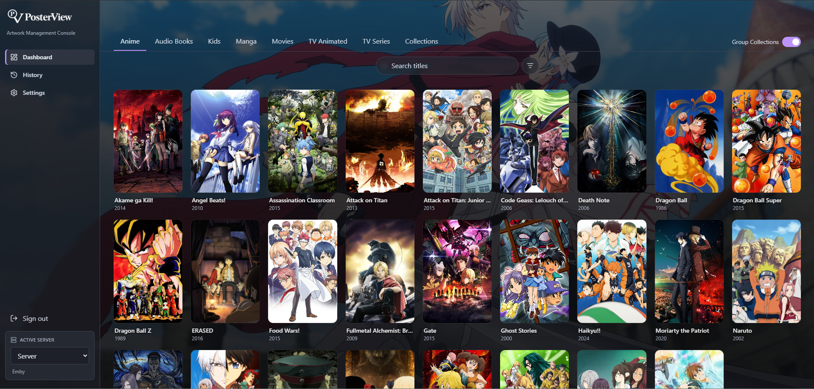
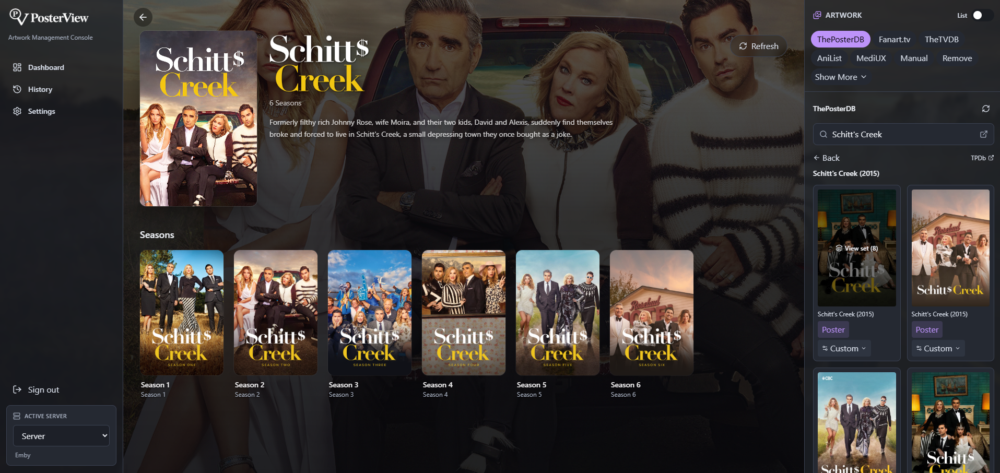
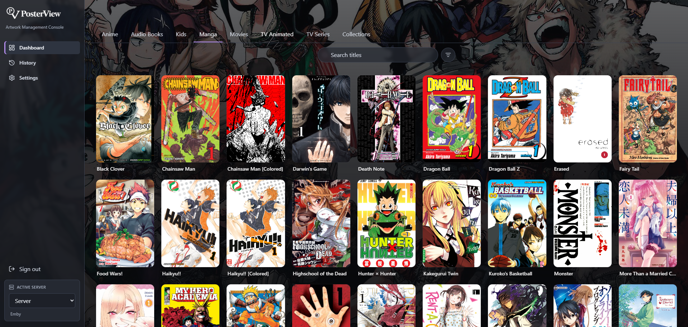
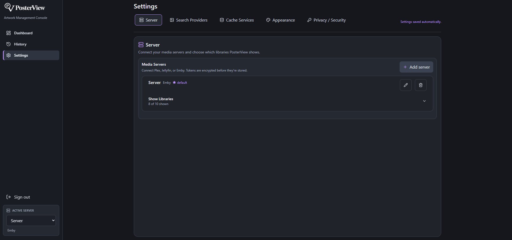
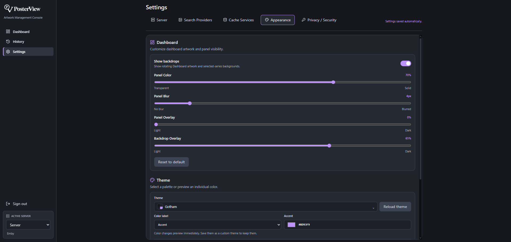
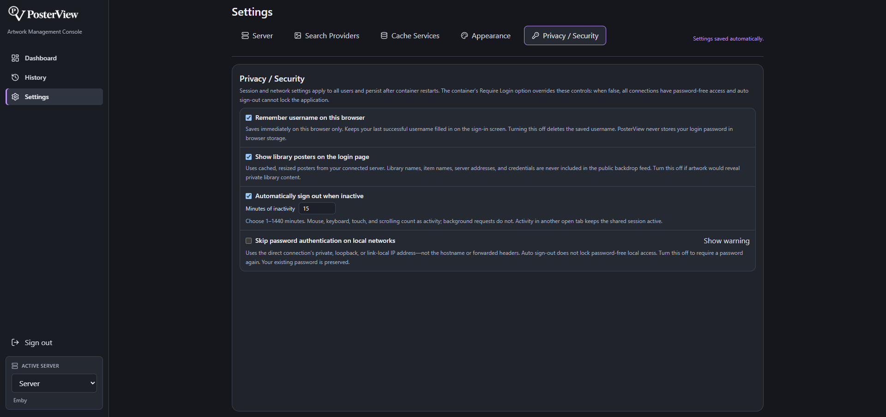
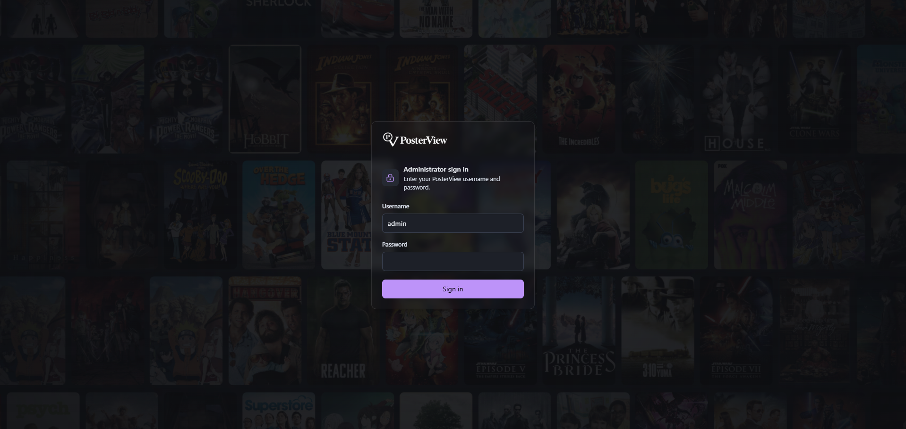

# PosterView

**PosterView** is a self-hosted, open-source artwork and metadata manager for
**Plex / Jellyfin / Emby** libraries. Browse movies, shows, collections, and
**book libraries such as manga**, then swap in posters,
backgrounds, and logos from [ThePosterDB](https://theposterdb.com), [Fanart.tv](https://fanart.tv),
[TheTVDB](https://thetvdb.com), [AniList](https://anilist.co), and [MediUX](https://mediux.pro),
plus manga covers and metadata from AniList Manga, MangaDex, VIZ, and ComicVine
— per image, per season (including Season 0 / Specials), per title inside a collection, or a
whole ThePosterDB set onto a series and all its seasons at once. Every apply is remembered, so
a bad pick is one click to undo.



_Open a title and swap its artwork from multiple sources, or manage a manga series and its
book covers from the same Dashboard._

<p align="center">
  
  
</p>

_Configure your media servers and customize PosterView's shared appearance in Settings —
credentials are encrypted at rest and never sent back to the browser._

<p align="center">
  
  
</p>

<p align="center">
  
</p>

<details>
  <summary>Login screen</summary>
  <br />
  
</details>

> ⚠️ ThePosterDB has no public API. PosterView scrapes it while signed in with **your own
> account**, the same way the established community tools do. Use it for your own libraries
> and be considerate of their service. The scraping/session implementation lives in
> `crates/posterview-infra-artwork/src/posterdb.rs` so site changes stay isolated.

---

## Experimental channel

`main` publishes `ghcr.io/bamcel/poster-view:latest`. Experiments on `experimental`
publish `ghcr.io/bamcel/poster-view:experimental`; testing pushes never update `latest`.
The testing branch starts from the current main version. Changes reach main only
when deliberately merged. `experimental` is updated on pushes, not on a nightly schedule.

In Unraid, select **experimental** from the app's branch options after the template
refreshes, or edit the container's Repository to `ghcr.io/bamcel/poster-view:experimental`.
For isolated testing, create a second container named `PosterView-Experimental`, choose
a different host port (for example `7980` mapped to container port `7979`), and use
`/mnt/user/appdata/posterview-experimental` for `/config`. Do not share the live appdata
folder between containers. Leave `/media` unmounted or use sample media to avoid
changing live NFO files or artwork. Testing with a connected media server can also
change its artwork, so use a test library/server when exercising apply actions.

Switching back to `:latest` changes the software, not the stored data. Keep a backup
before testing with existing appdata: a future experimental database change may
not be compatible with older versions. Local development for this channel uses
`git switch experimental`; reviewed work can be merged into main through a PR.

## Documentation

- [Getting started and key features](docs/user-guide.md)
- [Book libraries: manga, comics, and books](docs/book-libraries.md)
- [Local book and manga metadata](docs/local-metadata.md)
- [MangaDex covers](docs/mangadex-covers.md)
- [Documentation index and developer references](docs/README.md)

## Features

- **Book and manga libraries**: browse Emby/Jellyfin book-style libraries alongside movies and
  shows, open series folders and their volumes/chapters, use poster artwork as mobile rotating
  backdrops, add a manual series backdrop, and search AniList Manga, MangaDex, VIZ, or ComicVine.
  Screen-artwork databases remain available under **Show More** when you want to reuse their art.
- **Custom local NFO metadata**: mount book or manga folders at `/media` and edit a
  `<series folder name>.nfo` sidecar directly from the selected series. PosterView's UTF-8 XML
  format uses a `<series>` root and supports `title`, `originaltitle`, `translatedtitle`, `year`,
  `plot`, `publisher`, `edition`, `volumes`, `status`, `anilistid`, `malid`, `comicvineid`,
  `genres`, `tags`, `creators`, `country`, and `sourcematerial`. Each AniList or ComicVine link
  is stored in its own `<source>` element, so metadata assembled from multiple databases keeps
  every source URL. Existing `series`, `book`, and `tvshow` roots and unrelated XML fields,
  attributes, and comments are preserved when possible; PosterView does not leave `.nfo.bak`
  files in the media folder. See [setup, format, and compatibility](docs/local-metadata.md).
- **Multiple artwork sources** behind one panel: ThePosterDB (search → title → set drill-down,
  with per-set poster counts and empty results auto-hidden), Fanart.tv, TheTVDB, AniList,
  MediUX, AniList Manga, MangaDex, VIZ, and ComicVine. Sources use known
  TMDB/TVDB/IMDb/AniList IDs when available; otherwise search by title and choose the right
  match. PosterView's scheduled Sync can also resolve a missing TVDB/TMDB identifier by title
  before preloading compatible screen-artwork providers.
- **Collections**: a virtual **Collections** library lists every collection on the server —
  edit a collection's own poster/backdrop, browse the titles inside it, and jump straight to
  any member's own full detail page. A **Group Collections** toggle on the library view
  replaces a collection's member movies/shows with a single tile, like Emby's own library view
  — no more scrolling past every "John Wick" sequel individually. Live-verified on Emby/Jellyfin;
  the Plex-side code follows the same shape but hasn't been run against a real Plex server.
- **Apply history + revert**: every image you apply — from any provider or a manual upload —
  is remembered (up to 50 entries by default, globally — configurable). A global **History**
  page (sidebar) shows one tile per title+target, newest first; click a tile to see every
  version and **Revert** to any of them — so a bad pick costs nothing and you don't have to
  remember which title you last touched. Retention is configurable right there: how many
  entries to keep, an optional auto-purge for anything older than N days, or a
  manual **Purge now**.
- **Apply anywhere**: set any image as the poster, background, or clear logo — or use
  **Custom** to point it at any target, e.g. a movie poster onto a show's Specials season, or a
  poster from a collection's page directly onto one of its member movies without leaving the
  page.
- **Auto-apply set**: map an entire ThePosterDB set onto a show and its matching seasons in
  one click.
- **New-item detection**: a library remembers when you last visited it and flags titles added
  to the media server since then that still have no poster — a small banner plus a **NEW**
  badge on the poster card, so growing libraries don't quietly accumulate gaps.
- **Manual tab**: upload your own image file (or paste an image URL) and apply it to any
  target.
- **ID override**: each provider tab has a search box pre-filled from the item's known ids;
  type a different id (or, for AniList, a title) to fix a bad match on the spot.
- **Connection checks**: Settings can verify saved or newly entered Fanart.tv and TheTVDB
  credentials before you depend on them for artwork searches.
- **Persistent artwork cache**: provider results and proxied thumbnails are reused from the Docker
  data volume under `/config/artwork-cache/servers/{server_id}`. Each server has an independent
  250 MB default cap and 30-day expiry, including MangaDex/MediUX/PosterDB thumbnails and PosterDB
  data. Settings shows each server's usage and lets you change its limits or clear its cache.
  Existing cache entries and Watchdog inventories migrate automatically on startup, preserving
  cache ages. Legacy previews without a server identifier are copied into each server's quota;
  the shared files are removed only after every server migrates successfully.
- **Persistent media-image cache**: posters, backgrounds, logos, and other media-server images are
  stored under `/config/media-image-cache` after their first request, so repeat page loads do not
  download them from Plex, Jellyfin, or Emby again. This separate cache is capped at 10 GB with a
  365-day retention period. Applying or reverting artwork immediately replaces the affected
  title's cached image; editing or deleting a server clears that server's entries.
- **Per-title refresh + Artwork Watchdog**: right-click any movie, series, or collection in a
  library to refresh its cached provider data. The optional Watchdog in Settings → Database walks
  current libraries on a schedule and records a persistent inventory. After its initial build, it
  caches only new titles and removes item-linked data for titles no longer present. Interrupted scans
  resume from their checkpoint, and cleanup is skipped whenever any library or provider fails.
  Cancel interrupts in-flight requests. HTTP requests have 10-second connection and 30-second
  total timeouts; each Watchdog lookup has a 45-second deadline. Temporary failures retry up to
  twice after 1 and 2 seconds, then pause the run for five minutes. Invalid credentials and other
  permanent failures stop scheduling until you resolve the error and start Watchdog again.
  Settings → Database shows Idle, Scanning, Preloading, Stopping, or Failed for
  each server, plus its last successful run and next scheduled run. Connection-test results stay
  visible inside their provider cards. Disabled databases are excluded from caching.
  ThePosterDB prewarming keeps only the top three Movies,
  Shows, and Collections matches per title. Those cached matches appear immediately during an
  interactive search, then PosterView replaces them with every result that has artwork when the
  complete live search finishes.
- **Artwork source preferences**: choose the database that opens first for every title and enable
  only the sources you use. Existing installations keep all sources enabled by default. Ordinary
  preferences save automatically; artwork-source credentials share one explicit **Save Settings**
  action so partially entered secrets are never submitted.
- **Clear-logo detail pages**: the item view shows the server's stored logo art over a
  full-bleed, darkened backdrop behind the title details, seasons, and artwork panel.

## Architecture

A Rust/Axum backend serves a React single-page app and brokers all calls to your media
servers and artwork sources. The domain/runtime crates are host-independent so a Tauri host
can be added later without coupling PosterView to MKV Orchestrator:

```
frontend/                         React + Vite + TypeScript + Tailwind v4
apps/server/                      Axum HTTP host and SPA server
crates/posterview-runtime/        application orchestration and history
crates/posterview-contracts/      stable frontend/API contracts
crates/posterview-infra-sqlite/   SQLite + Fernet-compatible encrypted settings
crates/posterview-infra-media-servers/  Plex / Jellyfin / Emby adapters
crates/posterview-infra-artwork/  Fanart / TVDB / AniList / MediUX / ThePosterDB
```

- **Credentials are encrypted at rest** (Fernet) and never echoed back to the browser.
- **Images are proxied** through the backend, so origin tokens and the ThePosterDB session
  stay server-side and there's no CORS to fight.
- All three media servers are normalized to the same shapes, so the UI never branches on
  server type.

## Requirements

- **Docker** (easiest), or
- Rust 1.88+ and Node 20.19+ or 22.12+ for a local development setup.

## Run with Docker (recommended)

A single multi-stage image builds the frontend and serves it together with the API. Nothing
to install but Docker.

```bash
docker compose up -d --build      # build + run, http://localhost:7979
```

Or without Compose:

```bash
docker build -t posterview .
docker run -d --name posterview -p 7979:7979 -v posterview-data:/config posterview
```

Open **http://localhost:7979**. The SQLite database and encryption key live in the
`posterview-data` volume (`/config` in the container), so your servers and settings survive
restarts and image upgrades.

**Existing Docker/Unraid installations:** the image still detects and uses a legacy
`/data` application-state mount when `/config` has no database or encryption key.
You can update the image without changing your existing template. To adopt the
new **Config** path, change only the container destination from `/data` to `/config`;
keep the same host folder (for example `/mnt/user/appdata/posterview`) or named
volume. Do not delete or recreate the volume. Compose keeps the `posterview-data`
volume name and mounts it at `/config`. An explicit `POSTERVIEW_DATA_DIR` overrides
auto-detection; update that value too if you previously set it yourself. When both
locations contain state, `/config` takes precedence. Nothing is moved or merged.
The optional **Media** mount uses `/media`, separate from application state. Update any previous media mapping to `/media`. Explicit `POSTERVIEW_MEDIA_DIR` overrides take precedence.

PosterView's administrator username defaults to `admin`. Change it with `POSTERVIEW_USERNAME`
in your `.env` file or the **Administrator Username** field in the Unraid XML template, then
recreate the container. Usernames are case-sensitive.

The Unraid XML template includes **Require Login**, a `false`/`true` option defaulting to `false`.
It sets `POSTERVIEW_AUTH_ENABLED`: `false` disables login for **all connections**, including
reverse proxies and remote visitors; `true` enables login (subject to the optional LAN bypass).
With login disabled, inactivity sign-out cannot lock access. Use disabled login only on a
trusted network. Username/password settings are retained for when login is enabled again.
Outside the Unraid template, omitting this variable keeps authentication enabled. Recreate the
container after changing the variable.

PosterView requires an administrator password. Set `POSTERVIEW_PASSWORD` in a local `.env`
file before starting Compose, or let PosterView generate a strong password on first launch and
retrieve it with:

```bash
docker compose exec posterview cat /config/admin-password.txt
```

When an HTTPS reverse proxy terminates TLS, also set `POSTERVIEW_SECURE_COOKIES=true` so the
session cookie is sent only over HTTPS.

**Reaching your media server from the container:**

- Media server elsewhere on your LAN → just use its normal address (e.g. `http://192.168.1.20:8096`).
- Media server over **Tailscale** → use its direct Tailnet address (for example,
  `http://100.x.x.x:8096`) or a MagicDNS name that resolves from the Docker host.
- Media server behind a domain/reverse proxy → use the complete URL, including `http://` or
  `https://` and a port when it is not the protocol default (for example,
  `https://media.example.com`).
- Media server running on the **same host** as Docker → use `http://host.docker.internal:32400`
  (Plex) or `:8096` (Jellyfin/Emby). The provided `docker-compose.yml` already maps
  `host.docker.internal`; with plain `docker run` add `--add-host=host.docker.internal:host-gateway`.

Use **Test connection** before saving a remote server. The machine running Docker must be able
to reach the address itself; a URL that works only inside another device's browser is not enough.

### Network security

PosterView is an administrative tool: it stores media-server credentials and can replace or
revert library artwork. By default, all API routes except the health check and sign-in flow require an
HttpOnly, same-site administrator session. Keep port `7979` on a trusted LAN or behind an HTTPS
reverse proxy; the login is an application boundary, not a substitute for firewalling and TLS.

In **Settings → Privacy / Security**, you can configure:

- **Login poster backdrop:** enabled by default. While login is required, the sign-in screen shows
  randomized poster rows from the default (or first) connected server. Each row represents one
  library, rows alternate left/right motion, and a dark transparent treatment keeps the form
  readable. Poster order reshuffles when the cache and page refresh. The public feed contains only
  locally cached 280×420 JPEGs with opaque names—never library/title names, item IDs, server URLs,
  or credentials. Disable it if showing library artwork before sign-in is inappropriate.
- **Remember username on this browser:** enabled by default. The last successful username stays
  filled in after sign-out and on future visits. Turning it off immediately removes the saved
  username. This preference is local to each browser/origin and saves immediately; PosterView
  never saves your login password in browser storage.
  With remembering enabled, the sign-in form also reads the configured username from the server,
  so changing `POSTERVIEW_USERNAME` replaces an outdated autofill value. It does not overwrite
  a username you are actively editing. The username is provided by the public sign-in status
  endpoint; the password is never returned.
- **Automatic sign-out:** optionally expire password-authenticated sessions after 1–1440 minutes
  of inactivity. Disabled by default. Mouse, keyboard, touch, and scrolling count as activity;
  background requests do not. Activity in another tab on the same origin keeps the shared session
  active. The server also enforces expiry when the browser is closed or suspended.
- **Skip password authentication on local networks:** disabled by default. When enabled, direct
  connections from private, loopback, or link-local IP addresses receive full access without a
  password. The direct connection's address is used, not the hostname or forwarded headers.
  **A reverse proxy or Docker networking can make remote visitors appear local, including visitors
  using your public domain. Enable only if you accept that they may also bypass authentication.**
  Auto sign-out and the Sign out button do not lock password-free local access. Disable this
  setting to require the existing password again.

Preferences are saved in `/config/security-settings.json` and survive container restarts. To restore
the defaults outside the UI, stop the container, remove only that settings file, then restart it.
The password and media-server data are preserved. Sessions themselves are not persisted.
The poster cache is stored separately under `/config/login-backdrop`, refreshes at startup, after a
successful login, when a server is added, or when the setting is enabled, and keeps the prior cache
if the media server is temporarily unavailable. The login page has a clean themed fallback until
the first cache is ready. Reduced-motion browser preferences pause the row animation.

Media-server base URLs may intentionally target LAN, loopback, or Tailnet hosts, but must be
valid HTTP(S) URLs without embedded credentials. User-selectable artwork downloads are restricted
to the selected provider's HTTPS domain, including every redirect.

To update after pulling new code: `docker compose up -d --build`.

## Run on Unraid

A ready-made Docker template is at [`templates/posterview.xml`](templates/posterview.xml) — it points at
the pre-built image on GHCR (`ghcr.io/bamcel/poster-view:latest`, published automatically by
[a GitHub Action](.github/workflows/docker-publish.yml) on every push to `main`), maps the web
UI to port `7979`, persists `/config` to `/mnt/user/appdata/posterview`, and adds the same
`host.docker.internal` mapping as the Compose file above.

1. **Tools → Terminal** (or SSH in) and run:
   ```
   curl -L -o /boot/config/plugins/dockerMan/templates-user/my-posterview.xml \
     https://raw.githubusercontent.com/bamcel/poster-view/main/templates/posterview.xml
   ```
2. **Docker** tab → **Add Container** → pick **PosterView** from the **Template** dropdown at the
   top. Set the **Data** path if you don't want the default `/mnt/user/appdata/posterview`, then
   **Apply**.
3. Open the WebUI from the Docker tab once it's healthy.

Unraid's own **Template repositories** field (Add Container → scroll to the bottom → paste the
same raw URL → Save) is the "official" way to register a template and should also work. The
local-file method above is recommended instead because it's what's actually been confirmed
working — **the file has to land in `templates-user/`, not `templates/`** (the latter is treated
as Community-Applications/system-managed and silently produces a blank/default Add Container
form, even with a valid template selected from the dropdown).

## Quick start (development)

Two processes: the API on `:7979` and the Vite dev server on `:5173` (which proxies `/api`).

**1. Backend**

```bash
cargo run --package posterview-server   # http://localhost:7979
```

**2. Frontend** (second terminal)

```bash
cd frontend
npm install
npm run dev                        # http://localhost:5173
```

Open **http://localhost:5173**.

## Production (single process)

Build the frontend; Axum then serves it from the same origin as the API:

```bash
cd frontend && npm run build       # outputs frontend/dist
cd .. && cargo run --release --package posterview-server
```

Override the bind address, data directory, built UI directory, administrator password, and secure
cookie behavior with `POSTERVIEW_BIND`, `POSTERVIEW_DATA_DIR`, `POSTERVIEW_UI_DIR`,
`POSTERVIEW_PASSWORD`, and `POSTERVIEW_SECURE_COOKIES`.

## First-run setup

1. Open **Settings**.
2. **Add a media server** — name, type, URL, and token:
   - **Plex token**: open Plex Web → any item → ⋯ → *Get Info* → *View XML*, copy the
     `X-Plex-Token` from the URL.
   - **Jellyfin / Emby API key**: Dashboard → *API Keys* → add one.
   - Use **Test connection** to confirm before saving.
3. **Add your ThePosterDB account** (email + password) and hit **Test login**.
4. *(Optional)* Under **Settings → Search Providers**, add a free
   [Fanart.tv personal API key](https://fanart.tv/get-an-api-key/) and/or a
   [TheTVDB v4 API key](https://thetvdb.com/dashboard/account/apikey) to enable those tabs.
   Use each provider's **Test API** button to verify the key. AniList and MediUX need no key or
   account — they're ready to use immediately.

## Using it

1. Pick a server (sidebar) and a **library** (tabs), then **click** a title to open it —
   the artwork panel searches for it automatically. A **Collections** library tab lists every
   collection on the server; use the **Group Collections** toggle (top-right of the library
   view) to switch a regular library between showing each collection's movies/shows
   individually or collapsed into one tile.
2. **ThePosterDB tab**: pick a title from the categorized results (Movies / Shows /
   Collections, with counts), hover a cover and **View set (N)** to see the full set, then
   apply single images or **Auto-apply set**.
3. **Fanart.tv / TheTVDB / AniList / MediUX tabs**: artwork loads by the item's ids, grouped
   into Posters / Backgrounds / Banners / Logos. Wrong match? Type the right id in the search
   box.
4. **Manual tab**: upload a file or paste an image URL, choose the target, apply.
5. On any image, **Custom** lets you choose exactly where it lands — poster, background,
   logo, a specific season, or — on a collection's page — any of its member movies/shows,
   without leaving the page.
6. **History** (sidebar): one tile per title+target across the active server, newest first —
   click a tile to see every version applied to it, jump to the title, or **Revert** to an
   earlier image. Set how many entries to keep (50 by default) and an optional auto-purge age
   in days — entries *older than* that are removed, everything newer is left alone regardless
   of count — or hit **Purge now** to trim it immediately.

## API

The frontend uses the following stable HTTP API endpoints:

| Method | Path | Purpose |
| --- | --- | --- |
| `GET/POST/PATCH/DELETE` | `/api/servers…` | manage media servers |
| `POST` | `/api/servers/{id}/test` | test a saved connection |
| `GET` | `/api/servers/{id}/libraries` | list libraries (includes a virtual `collections` one, Emby/Jellyfin) |
| `GET` | `/api/servers/{id}/libraries/{lib}/items[?group_collections=]` | list titles; toggle collection grouping (default on, Emby/Jellyfin) |
| `GET` | `/api/servers/{id}/items/{item}` | item detail: seasons, members (if a collection), logo, external ids |
| `GET` | `/api/servers/{id}/image?ref=…` | auth'd media-server image proxy |
| `PUT` | `/api/posterdb/credentials` | save ThePosterDB login |
| `GET` | `/api/posterdb/search?server_id=&term=` | categorized ThePosterDB search |
| `POST` | `/api/posterdb/verify?server_id=` | poster counts per title (hides empty results) |
| `GET` | `/api/posterdb/set?server_id=&url=` | scrape a set / poster / title page |
| `GET` | `/api/posterdb/image?server_id=&url=` | cached ThePosterDB thumbnail proxy |
| `POST` | `/api/posterdb/apply` | download an image + apply to a server |
| `GET` | `/api/artwork?provider=&server_id=&item_id=[&id_override=]` | Fanart/TVDB/AniList/MediUX artwork |
| `GET` | `/api/artwork/search?provider=&server_id=&item_id=&query=` | title search + picker for Fanart/TVDB/MediUX when no id is known |
| `GET/PUT` | `/api/artwork/settings` | API keys, default source, and enabled databases |
| `GET/PUT/DELETE` | `/api/artwork/cache/{server_id}` | cache usage, limits, expiry, and clear |
| `POST` | `/api/artwork/cache/refresh` | refresh and prewarm one movie/show/collection |
| `POST` | `/api/artwork/cache/{server_id}/watchdog/run` | start a full-library prewarm in the background |
| `POST` | `/api/artwork/cache/{server_id}/watchdog/cancel` | cancel an active scan, including in-flight requests |
| `GET` | `/api/artwork/mangadex/image?server_id=&url=` | cached MangaDex thumbnail proxy |
| `GET` | `/api/posterdb/search/preview?server_id=&term=` | cached top-three matches per category |
| `POST` | `/api/artwork/test` | verify saved or supplied Fanart/TVDB credentials |
| `GET` | `/api/artwork/mediux/image?server_id=&url=` | cached MediUX thumbnail proxy |
| `POST` | `/api/artwork/upload` | apply a user-uploaded image file |
| `GET` | `/api/history?server_id=[&item_id=&target=&limit=]` | apply history — global feed when `item_id` is omitted |
| `GET` | `/api/history/{id}/image` | a history entry's stored image |
| `POST` | `/api/history/{id}/revert` | re-apply a history entry as current |
| `GET/PUT` | `/api/history/settings` | `max_entries` (global cap) and `purge_days` (0 = disabled) |
| `POST` | `/api/history/purge?days=` | purge now; omit `days` to use the saved setting, `0` purges everything |

## License

MIT — see [LICENSE](LICENSE).
