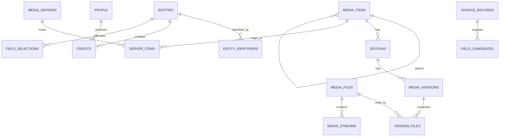

# PosterView media catalog proposal

Status: design for review; no application, database, NFO, or server changes implemented.

## Recommendation

Make PosterView the editable, server-independent catalog for the collection. Import existing server metadata and local sidecars, retain source observations, resolve them into reviewed catalog values, and publish selected changes through destination adapters.

Keep the existing Rust/Axum/React stack and SQLite initially. Extend `posterview.db` through numbered migrations, retaining the current settings, encrypted credentials, and artwork history. Use normalized tables for searchable metadata and relationships; JSON for original source payloads and provider-specific extensions. Do not make one JSON document the entire catalog.

The catalog owns stable IDs. Plex rating keys, Emby/Jellyfin item IDs, provider IDs, filenames, and paths are mappings, not catalog primary keys. A work, its editions, and its physical files are separate records.

## Code inspection and reuse

| Existing code | Finding | Proposed reuse |
| --- | --- | --- |
| `crates/posterview-infra-sqlite/src/lib.rs` | Tables are `media_servers`, `settings`, and `apply_history`; foreign keys enabled; incremental column migrations | Keep connections/settings/secret handling and historical data; add versioned catalog migrations and repositories |
| `crates/posterview-infra-media-servers/src/lib.rs` | Server authentication, library/item reads, image reads/uploads/deletes; item projections expose a limited metadata subset | Extend full metadata reads and add destination-specific metadata write/verify adapters |
| `crates/posterview-contracts/src/lib.rs` | Current item detail includes title/year/summary/IDs, artwork, seasons, and members | Keep existing API contracts compatible; introduce catalog DTOs with episodes, credits, editions, and technical media information |
| `apps/server/src/metadata.rs` | Local book/manga NFO editor, provider previews, revision checks, XML preservation, guarded paths and atomic writes | Extract reusable NFO infrastructure and introduce media-type/destination profiles |
| `crates/posterview-infra-artwork/` and runtime | Artwork providers, AniList/ComicVine metadata, caching/history | Keep artwork workflows; expose metadata providers through a separate enrichment interface |
| Sibling `media-console-engine/apps/server/src/local_library.rs` | Folder browsing, local artwork, movie/TV NFO reads, season/episode parsing | Adapt discovery and filename conventions; replace path-derived item identity and JSON library configuration with catalog IDs/tables |

The sibling NFO reader currently caps repeated values and cast at 20. That is inappropriate for full metadata ingestion; replace silent truncation with complete bounded parsing and explicit limit errors. It is a useful prototype, not a finished catalog database.

Backup-folder inspection is out of scope following the user's clarification. The sibling project was inspected as an available local reuse reference.

## Logical database layout

`id` denotes a stable primary key. Named parent/entity/source IDs are foreign keys unless explicitly described as external values. Catalog entities use UUID text IDs; local high-volume event tables may use integer IDs. All mutable catalog records have UTC timestamps and participate in an entity revision.

| Tables | Main columns and purpose |
| --- | --- |
| `schema_migrations` | `version PK`, `checksum`, `applied_at`; ordered, transactional migrations |
| `media_servers` (existing) | Existing connection ID and encrypted credential reference; add server instance identity/version observations so reused remote item IDs after a rebuild do not silently remap |
| `libraries`, `library_roots`, `library_entities` | Logical library identity/type; multiple filesystem roots; many-to-many membership of catalog entities |
| `server_libraries`, `path_mappings` | Server instance + remote library ID to local library; server path prefix to mounted root; explicit case/path semantics |
| `entities` | `id PK`, `kind`, `revision`, `created_at`, `updated_at`, `archived_at`; shared identity for media, people, organizations, and collections |
| `media_items` | `entity_id PK/FK`, `media_type`, `parent_id FK`, preferred title/sort title/original title, synopsis, tagline, year, dates, language, status, descriptive runtime; movie/show/season/episode/book/audiobook/manga support |
| `episode_numbers` | `item_id FK`, `scheme`, `season_number`, `episode_number`, optional ending episode; aired/DVD/absolute numbering remains distinct |
| `item_titles`, `item_texts` | `item_id FK`, language, region, title/text type, value; alternate names, translations, localized descriptions |
| `editions` | `entity_id PK/FK`, `item_id FK`, name, cut/edition type, language, release date, publisher reference, edition-specific volume totals; physical variants do not duplicate the underlying work |
| `entity_identifiers` | `entity_id FK`, provider, provider entity namespace, external value, source observation; supports TMDb/TVDb/IMDb/AniList/MAL/ComicVine/ISBN and person/organization IDs |
| `entity_links` | `entity_id FK`, link type, URL, label, language, source; websites, trailers, provider pages and related links |
| `terms`, `entity_terms` | Typed terms and entity joins; genres, tags, countries, languages, content descriptors; no comma-delimited storage |
| `people`, `organizations` | `entity_id PK/FK`, preferred name and profile fields; cast/crew identities, studios, networks, publishers |
| `credits` | `id PK`, `subject_entity_id FK`, `person_id FK`, department, job, character, billing order, credited-as name, language; multiple roles for one person allowed |
| `entity_organizations` | `entity_id FK`, `organization_id FK`, relationship type; produced-by, distributed-by, published-by, network |
| `entity_relationships` | `from_entity_id FK`, `to_entity_id FK`, relation type, position; collection membership, adaptations, related works; use parent IDs for the primary show/season/episode tree |
| `ratings`, `certifications` | Entity, source/system, score and scale/votes; entity, country/system, age certificate; distinguish editorial ratings from user activity |
| `media_versions`, `media_files`, `version_files` | Version belongs to an edition; files have root-relative paths, size, mtime, optional fingerprint, container/duration and presence state; ordered joins allow multipart versions |
| `version_items` | Version to media item with optional segment boundaries; supports a single file containing multiple episodes |
| `media_streams`, `chapters` | File FK, stream index/type, codec/profile, language, channels/layout, dimensions, frame rate, bit depth, HDR, bitrate, subtitle/default/forced flags; file FK and chapter start/end/title |
| `artwork_assets`, `entity_artwork` | Asset hash, cache-relative path/source URL, MIME type/dimensions/language; entity join, artwork role, order and preferred selection |
| `sources`, `source_records` | Source kind and identity; external record key, payload format/schema, raw payload/hash, fetched time, availability and import run; immutable observations before normalization |
| `entity_source_links` | Entity FK, source record FK, match method/confidence/status; ambiguous matches stay unlinked or pending review |
| `field_candidates`, `field_selections` | Entity FK + typed field path (including language or relation scope); candidate value/source record; accepted candidate/manual value, lock and revision; provenance for scalar fields and complete relationship sets |
| `metadata_policies` | Library/media-type/field precedence, preferred language, fill-missing/replace/merge behavior; manual locks win by default |
| `nfo_documents`, `nfo_bindings` | Unique root-relative NFO path, profile/root element, raw XML/hash/revision, last read/write status; bindings to one or more catalog entities/files for shared or multi-episode documents |
| `server_items`, `server_item_files` | Server instance + external item ID, remote library, mapped catalog item/edition, match state, last seen/snapshot; optional remote-media-to-local-file mappings |
| `sync_targets`, `sync_state` | Selected destination/profile/field policy; entity/destination/field baseline, last verified values, catalog revision and status for three-way comparisons |
| `jobs`, `job_items`, `publish_operations` | Durable import/enrich/probe/export jobs; per-item progress, attempts, retry timing; immutable planned changes with destination, expected revisions/hashes, idempotency key and before/after values |
| `conflicts`, `change_events` | Conflicting base/local/remote values and resolution; append-only actor/source/revision/change history, including relation changes |
| `catalog_search` | Rebuildable FTS5 index for titles, synopsis, people and aliases; indexed relational filters for library/type/year/genres/tags |

Type-specific fields that do not fit common tables belong in typed extension tables, for example book publication/volume information. Unknown provider fields remain in source payloads and a source-details view until explicitly mapped. This preserves information without falsely implying that every field is editable or publishable.

### Relationships

The diagram shows key relationships; `media_items`, `editions`, `people`, and `organizations` are typed extensions of `entities`.

### Constraints and storage rules

- Enforce FKs, required fields, enumerations, and uniqueness in SQLite; validate type compatibility and prevent hierarchy cycles in catalog transactions.
- Unique remote key: `(server_instance, external_item_id)`. Unique location: `(root_id, normalized_relative_path)`. Unique stream: `(file_id, stream_index)`.
- Namespace provider identifiers by provider and entity type. Do not apply an unconditional global unique constraint to imported provider IDs: duplicates/mismatches must be reviewable. Index them for matching; enforce one preferred resolved ID per entity/provider/namespace where appropriate.
- A work ID shared by two cuts does not make those cuts the same edition. Names alone never trigger automatic merges, including person names.
- Missing, explicitly cleared, unsupported, and not yet fetched are different states. A partially populated server response cannot erase catalog data.
- Field selections and normalized query tables update in one transaction; the latter are projections of the selected metadata, not a second independent source of truth.
- Use foreign-key indexes, WAL on supported local storage, busy timeout and a bounded writer queue. Keep the application database on local persistent storage; media roots can be network mounts.
- Use the SQLite backup mechanism for consistent backups, including encryption key recovery and an asset manifest. Test restore and migration recovery; do not copy a live database file while ignoring its WAL.
- Keep media bytes outside the database. Store artwork bytes in the existing asset cache. Retain raw source/NFO revisions with configurable history limits.

## Import, editing, and publishing behavior

1. Import selected server libraries and/or local roots with pagination, checkpointing and resumable jobs. Preserve full source payloads before mapping fields. Failed/incomplete scans never mark an entire library deleted.
2. Resolve identity using provider namespace + ID + media type and hierarchy, supplemented by mapped file paths and edition evidence. Queue conflicting IDs and title/year-only matches for review. Allow reversible manual merge/split/relink.
3. Fetch provider metadata by confirmed identity and language. Show field-level alternatives and attribution. Start with existing AniList/ComicVine integration and add movie/TV provider adapters after credential/usage requirements are verified.
4. Probe mounted files for technical information using an isolated media-probe adapter. Preserve server-reported technical data separately. A failed probe means unknown/unavailable, not a zero-value replacement. Codec/resolution values describe files and are not ordinary metadata edits to push.
5. Save catalog edits locally with optimistic revision checks and field/set locks. Batch edits produce an explicit diff including list replacement versus merge and explicit clears.
6. Build a destination-specific publish plan. Display writable, read-only, unsupported and lossy fields. Unsupported data remains in PosterView and applicable NFO profiles.
7. Compare last verified baseline, current catalog and fresh destination values. Queue conflicts when both changed; preserve unrelated remote fields. Where a server requires a full update object, fetch it and modify only selected fields before submission.
8. Persist publication intent alongside the catalog revision. Workers execute API/NFO operations, retry safely, then read back and normalize the result before recording success. A timeout after a write triggers read-back before retry.
9. Track each destination independently. Success on Jellyfin and failure on Plex is partial success, not global completion. Remote APIs and filesystem writes cannot form one atomic transaction; compensating restores require a new preview and a current-state check.

Default publishing is deliberate: choose items, destinations, fields, and review changes. Scheduled propagation can be enabled later per library after validation. No direct writes to Plex/Emby/Jellyfin databases. Watch state, play counts, and user preferences stay outside shared descriptive metadata in the first release.

## NFO profiles

Retain the current PosterView book/manga profile. Add movie/show/season/episode profiles and explicit Jellyfin/Emby/Kodi-compatible mappings where verified. A generic universal NFO writer would obscure differences in names, tags and supported values.

Preserve unknown XML, comments and attributes where possible; retain original bytes as the recovery snapshot. Show semantic changes and any formatting changes. Keep the existing stale-revision check, size/DTD restrictions, mount boundary checks, no-clobber creation and same-directory atomic replacement. Record pre-write state under application storage rather than littering media folders with backup files.

Track a physical NFO once even when several servers read it. Warn in the publish preview when a sidecar change affects shared readers. NFO changes can influence subsequent server refreshes; do not automatically request a broad provider refresh after applying curated metadata.

## Console layout

- Catalog: one collection-wide view, library/media-type/genre/tag/person/quality filters, missing-data filters, match status and destination drift.
- Item editor: Overview, Identity & Links, Genres & Tags, Cast & Crew, Editions & Files, Media Info, Artwork, NFO, Sources & History, Publish.
- Match review: unresolved imports, conflicting identifiers, duplicate candidates and explicit merge/split tools.
- Publish review: side-by-side current/proposed values per destination, field support, lock behavior, conflicts and results.
- Jobs: imports, provider fetches, probes and publishing with progress, resume/retry and individual failures.

## Implementation sequence and acceptance gates

| Phase | Deliverable | Acceptance gate |
| --- | --- | --- |
| 0. Adapter contract | Fixture inventory; exact source-to-catalog and catalog-to-destination field matrix against installed server versions | Reuse decisions tied to actual modules; unsupported/unverified fields explicitly identified |
| 1. Catalog foundation | Numbered migrations, entities/editions/files/source snapshots, repositories, revisions, jobs and search | Existing settings/history preserved; clean and upgrade migrations, restore test, identity/constraint tests pass |
| 2. Read-only ingestion | Full paginated server imports, NFO/folder import, identity review and persistent catalog browser | Repeated imports are idempotent; multi-server duplicates, editions, multi-episode files and interrupted/offline scans handled |
| 3. Metadata console | Structured editor, cast/crew, identifiers, tags, providers, provenance, field locks, file probing and artwork integration | Manual values survive refresh; multilingual/list semantics and conflicting edits verified |
| 4. NFO round trip | Profiles, diff preview, XML preservation and tracked writes | Movie/show/season/episode/book fixtures, unknown tags, repeated credits, stale edits and shared sidecars verified |
| 5. API publishing | Jellyfin, Emby and Plex adapters with per-version capabilities, previews, durable operations and read-back | Disposable server fixtures prove supported fields; unrelated values preserved; drift, timeout-after-write, retries and partial failure tested |
| 6. Operational completion | Bulk workflows, configurable schedules, history retention, performance tuning and backup/restore UI | Representative large-library import/search benchmark, restart recovery and end-to-end restore verified |

Start with movies and TV as the first end-to-end publishing slice while retaining current book/manga functionality and cataloging those types. Extend enriched book/manga publishing only where the actual destination supports it. Other types such as music can use the entity foundation later without delaying the first complete workflow.

## API and format references

- Plex documents metadata editing through its [Plex Media Server API](https://developer.plex.tv/pms/); exact field/lock support still needs adapter verification against the installed version.
- Jellyfin exposes an [item update request](https://typescript-sdk.jellyfin.org/interfaces/generated-client.ItemUpdateApiUpdateItemRequest.html) and documents [NFO filenames, fields and precedence](https://jellyfin.org/docs/general/server/metadata/nfo/).
- Emby's [developer discussion of item updates](https://emby.media/community/topic/125696-update-an-item-with-api/) identifies its item update flow. Validate the installed server's API contract before claiming field coverage; the requested official static reference was inaccessible during this review.

No claim is made that all three servers accept all catalog fields. Complete preservation belongs to PosterView; publication is constrained by each destination's capabilities.
